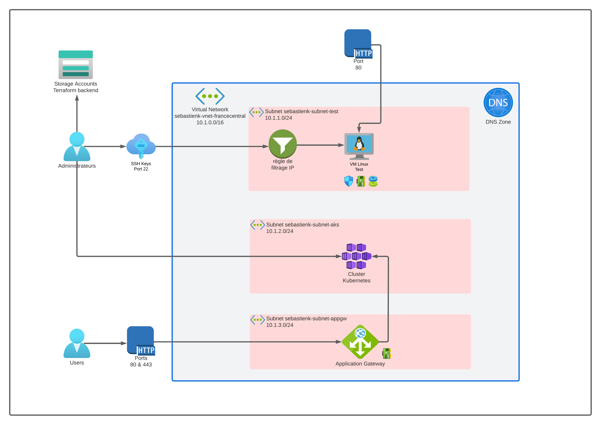

# ECF-2
---------
## POUR LE DEPLOIEMENT
---------

--------------------
### 0 - Prérequis

Avoir installé sur le poste :
- Terraform : version 1.5
- Ansible   : version utilisée core [core 2.15.1]
- Kubectl   : version 5.0.1

--------------------
### Variables à changer

Dans le dossier ./Terraform             => fichier locals.tf
Dans le dossier ./Terraform/backend     => fichier locals.tf
Dans le dossier ./Terraform/user_data   => fichier script.sh
Dans le dossier ./Terraform/            => fichier kubectl.tf

Ajouter les clés publiques ssh (exemple_rsa.pub) dans le dossier ./Terraform/ssh_keys/

__Attention__ : Nommer la clé ssh de la même façon dans le fichier locals.tf (sans l'extension .pub)

--------------------
### 1 - Lancement de Terraform

On se place dans le dossier Terraform

Avant de lancer déploiement de l'infrasctructure, il faut déployer le backend distant pour Terraform

- Backend Terraform

on se place dans le dossier backend

    terraform init

    terraform apply

- Déploiement infrastructure

on revient dans le dossier Terraform (niveau -1)

    terraform init

    terraform apply

Si **terraform** est déjà déployé par un collègue, il faut lancer un **terraform apply** pour générer certains fichiers :

    terraform apply -target local_file.inventory -target local_file.admin_rsa_file -target local_file.appli_commun_main_yml

---------------------

## Liste des ressources
- 1 **compte de stockage backend terraform** 		           (sebastienk******)
- 1 **clé ssh** créé aléatoirement + Clés admins supplémentaires (sebastien) 
- 2 **réseaux virtuels** 			           (sebastienk-vnet-francecentral) 
- 1 **sous-réseau** pour test      (sebastienk-subnet-test) 
- 1 **sous-réseau**	pour aks       (sebastienk-subnet-aks) 
- 1 **sous-réseau** pour appgw     (sebastienk-subnet-appgw) 
- 2 **NSG** 					           (sebastienk-vm-nsg)
- 1 **VM Linux (Machine test)** 		       (sebastienk-vm) 
- 1 **Cluster Kubernetes (AKS Prod)** 		(sebastienk-aks) 
- 1 **Load balancer (gateway Prod)**		       (sebastienk-gateway) 
---------------------
## Topologie

